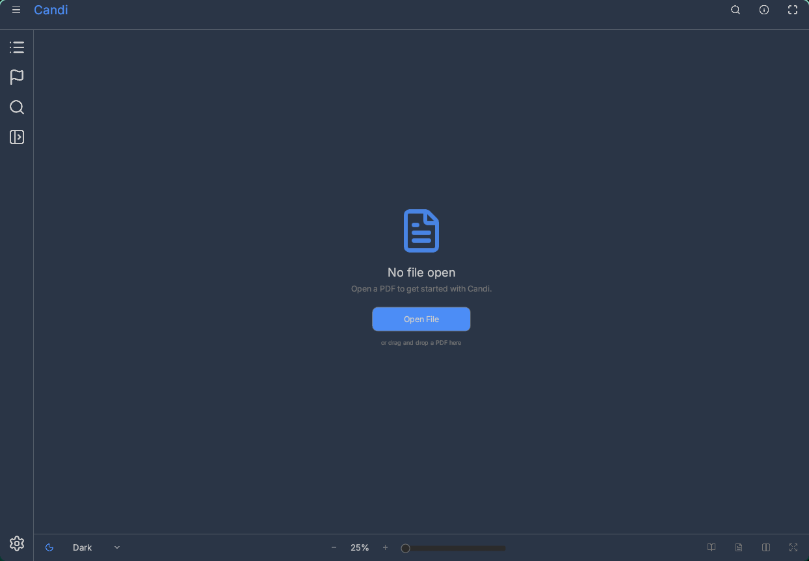
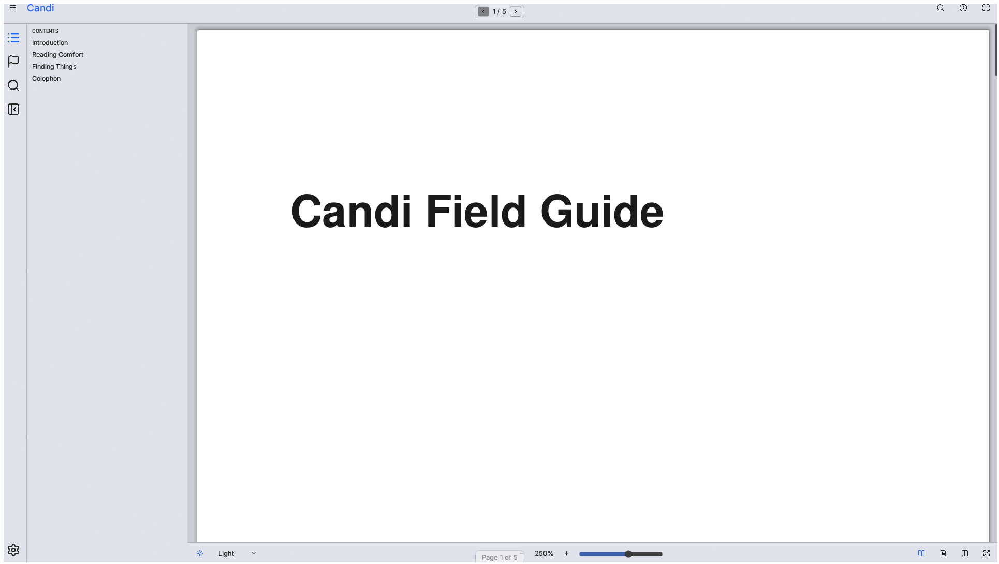
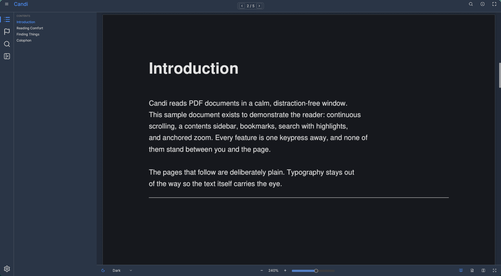

<p align="center">
  
</p>

# Candi

<p align="center">A clean, minimal, distraction-free PDF reader.</p>

<p align="center">
  <a href="LICENSE.md"></a>
  
  
  <a href="https://github.com/mehboobulqadri/candi/releases/latest"></a>
</p>

<p align="center">
  
  
  
</p>

## Features

- **Chromeless, distraction-free window** — the page is the interface; everything
  else lives on one bottom bar and one sidebar.
- **Contents, bookmarks, and search** — the contents sidebar mirrors the
  document outline and tracks the current section; bookmarks are one keystroke
  away; search highlights every match in place.
- **Dual PDF backends** — MuPDF (bundled, default) or an optional permissively
  licensed PDFium build via `--backend pdfium` and `PDFIUM_LIB`.
- **Themes** — five built-in themes (Light, Sepia, Dark, Warm Dark, True Dark),
  custom YAML themes in `~/.config/candi/themes/`, and accent tinting across
  selection, highlights, and progress markers.
- **Anchored zoom** — Ctrl+scroll zooms to the cursor, with a slider and
  fit-width flow so magnifying never loses your place.
- **Single and dual page view** — one page, or a two-page spread.
- **Reading-position resume** — position, zoom, and theme are remembered per
  book in a small sidecar next to the PDF; a recents list keeps books at hand.
- **Editable keybindings** — `~/.config/candi/keybinds.json`, seeded with the
  defaults.
- **Page toast** — a subtle page indicator appears on page turns and fades.
- **Headless mode** — `CANDI_NO_GUI=1` runs the shared core without the window
  for scripts and testing.
- **Lean binary** — a single ~34 MB executable; no runtime dependencies beyond
  the system.

## Requirements

64-bit Linux with glibc ≥ 2.35.

## Install

### 1. Download (easiest)

Grab `candi-<ver>-x86_64-linux-gnu.tar.gz` and its `.sha256` sidecar from the
[Releases](https://github.com/mehboobulqadri/candi/releases/latest) page:

```bash
sha256sum -c candi-<ver>-x86_64-linux-gnu.tar.gz.sha256
tar xzf candi-<ver>-x86_64-linux-gnu.tar.gz
cd candi-<ver>-x86_64-linux-gnu
./install.sh   # installs binary, desktop entry, icons to ~/.local (override: PREFIX=/usr ./install.sh)
```

Then run `candi`, or open a book directly: `candi book.pdf`.

### 2. cargo install

```bash
cargo install --git https://github.com/mehboobulqadri/candi.git --locked candi-gui --bin candi
```

Requires Rust stable and `clang` — MuPDF's bundled C sources compile at build
time (statically linked; not a runtime dependency).

### 3. From source

```bash
git clone https://github.com/mehboobulqadri/candi
cd candi
cargo install --path crates/candi-gui --locked
```

If `~/.local/bin` is not on your `PATH`, add it, then run `candi`.

## Optional: PDFium backend

The default MuPDF backend is AGPL-3.0 like the rest of Candi. If you need a
permissively licensed render path, build the `pdfium-backend` feature and point
`PDFIUM_LIB` at a directory containing `libpdfium.so`, then launch with
`--backend pdfium`. See [docs/architecture.md](docs/architecture.md) for the
backend trade-offs.

## Development

Feature work merges to `dev`; `main` carries versioned releases. Versioning
rules and release process: [docs/roadmap.md](docs/roadmap.md). Design decisions
live in [docs/architecture.md](docs/architecture.md).

```bash
cargo build --release -p candi-gui
target/release/candi book.pdf
```

## License

AGPL-3.0 — see [LICENSE.md](LICENSE.md). The optional PDFium backend is BSD-3-Clause
(its Rust wrapper MIT/Apache-2.0), so a PDFium-only build links no AGPL code.

## Maintainer

Mehboob ul Qadri — [mehboobulqadri@gmail.com](mailto:mehboobulqadri@gmail.com)
